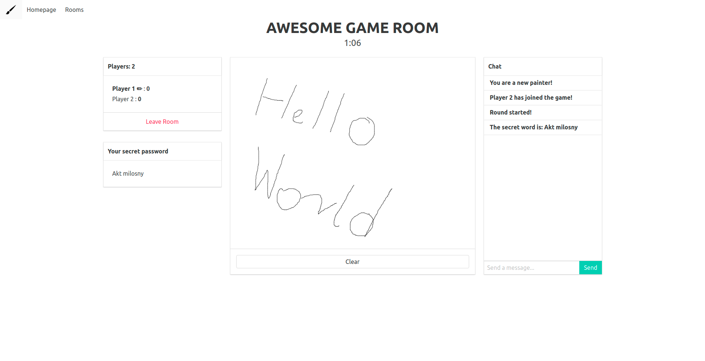

# Pictionary.io ✏️

> Traditional [pictionary](https://en.wikipedia.org/wiki/Pictionary) game moved to online experience!

## Objectives
+ The painter draw pictures which suggest the drawn word
+ The others try to guess the word to collect the most points

## How to play
1. Visit game's **[website](https://karol-waliszewski.github.io/pictionary.io/)** 🔗
2. Create a new room or join existing one
3. Choose your name
4. Enjoy 😊

### Technologies 🔧 
+ [Vue.js](https://vuejs.org/)
+ [Socket.io](https://socket.io/)

#### License ⚖️

[MIT](https://en.wikipedia.org/wiki/MIT_License)

#### Meta
Karol Waliszewski - [github](https://github.com/Karol-Waliszewski) - [karolwaliszewski@gmail.com](mailto:karolwaliszewski@gmail.com)

https://github.com/Karol-Waliszewski/pictionary.io